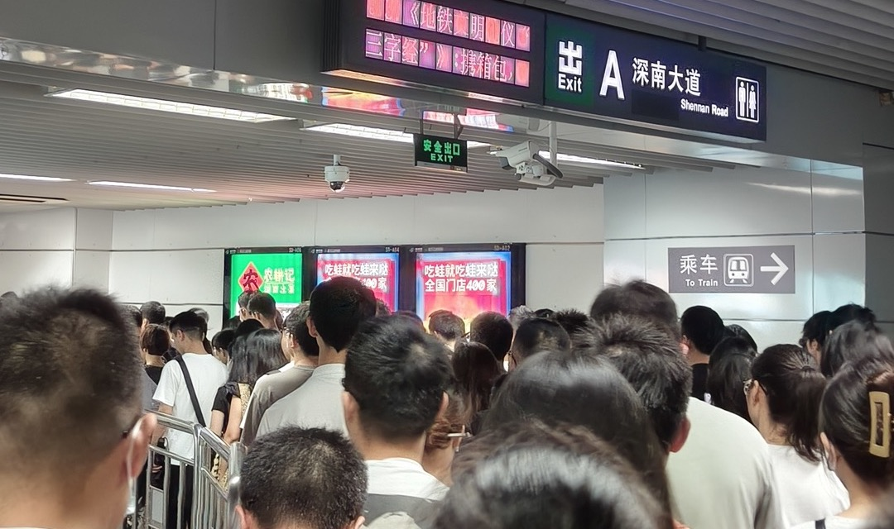

# Gap Years 结束

 (image resized). © [**James Maughn**](https://www.inaturalist.org/people/jmaughn). [*inaturalist.org*](https://www.inaturalist.org/photos/330290531).")

今天是入职第一天。好久没有融入上下班的人潮人海中，感觉陌生又熟悉。

## 找工作

这一轮找工作历时约一个半月，比我预计的要短一些。

### 慌乱的第一周

开始投简历的第一周一个面试机会都没有。有回应的拒绝原因基本都是：gap 时间太久（而履历本身不满足要求的大概率不会有回应）。这样的反馈让我有些慌乱，万一接下来的回复都是如此，那我基本就告别这个行业了。这几天让我重新体验了学生时代每次大考前的紧张——肠胃应激，而且应激的程度更严重。好在后面又逐渐适应恢复正常了。

### 面试数据

这次找工作主要用 Boss 直聘，加上其他渠道少量的尝试，汇总数据如下：

| 沟通数 | 投递数 | 进面数 | 终面数 | 暂无反馈 |
| ------ | ------ | ------ | ------ | -------- |
| `220`  | `50`   | `9`    | `3`    | `3`      |

在 `220` 个沟通中，大约有 `70` 个是我主动拒绝，基本上是看了岗位描述之后觉得就算过了也不会去，所以也不想浪费双方的时间。

### 少量经验总结

#### 简历

- 简历投递效果不好时，一定要找同类岗位的朋友帮忙看看是不是简历描述或者措辞有硬伤。
- **要不要注明 gap 时间段**？这个问题我得到的答案不一，但最后我选择直接注明：
  - HR 收到的简历数量可能非常多，他们不一定有空找你询问空窗原因，很可能看到有空窗直接就跳过了，所以不如自己先简要说明（⚠️ 这条不构成建议，仅仅是我自己的推测）。
- **要不要隐藏短暂工作经历，等面试沟通时再主动说明**？这个问题我得到的答案基本都是先隐藏再说明。但我还是选择了和 gap 时间段同样的处理方式，理由一致。
- 如果用人部门中没有人帮忙背书，内推和网投区别不大。
- 不是所有 HR 都介意 gap，有时候是用人部门介意。

#### 面试

- 不管是线上面试还是现场面试都准备好**纸和笔**，它们用来构建思路的效率比电脑要高，也能缓解紧张造成的注意力不集中。
- 和面试官沟通时，尽量把对方当成同事去沟通，这样更不容易紧张，也更能反映自己工作中沟通的状态。

#### Gap 量刑

早在辞职前我就在脉脉看到关于 gap 的风声鹤唳，当时我不是很信邪，不就 gap 一下，至于吗？不过这次找工作让我信了那句古话：**Gap 约等于坐过牢**。

而我的简历上面既有 gap 又有短暂工作经历。

被 HR 以 gap 太久为由拒绝时，我会询问他们能接受的 gap 时长大约是多少。结合在脉脉等平台看到的信息，gap 严重程度可以分为以下几个等级：

- `两个月及以下`：基本不影响，除非简历本身比较糟糕。
- `三到六个月`：需要有合理解释，有几位 HR 跟我说他们公司的底线是六个月。
- `七个月到一年`：据我认识的一位 HR `L33` 说，只要过往经历匹配度比较高（也可以说是看能力），一年左右的 gap 仍然可以接受，但有这个接受度的 HR 及用人部门真的不多，尤其是通过网投渠道。
- `一年到两年`：简历很大概率直达垃圾桶，能力及稳定性都会被怀疑。
  - 我落在这个区间，面试机会确实少得可怜。
- `两年以上`：难以想象的地狱难度（有请壮士现身说法）。

## 告一段落

### 对八股文的看法

所有人都不喜欢八股文，但是所有人不管是招聘方还是应聘方都在准备八股文，这种现象单单用劳资供需关系转变来解释是不够的……

八股文的大部分内容本身很有用，都是一些具体的技术点或是理论知识。只是这种面试考核方式非常像大学的时候大部分人都在期末时突击期末考，平时很少用到，考完过不了多久就忘了。长远地看我无法评价这种做法的合理性。

### 对 gap 的看法

其实大部分人对 gap 本身没有太大恶意，包括 HR。区别就在于，招聘方需要对“新招来一个人”这件事负责，而大部分人是厌恶风险的，多一事不如少一事。尤其是在简历收到手软的大背景下，他们自然而然会像设定学历门槛一样设定 gap 门槛。

如此对比下来，愿意接受 gap 的公司在**包容性**方面也就显得更加突出，我会认为给了我面试机会的 `9` 家公司大概率是更加包容的，无论结果如何，感谢他们。

以后我还敢 gap 吗？在给 gap 大军贡献了一点点普及率之后，我确实不敢了，除非中国的就业市场也能像一些发达国家那样对 gap 有足够的包容。不过我好像也不太有再来一次的需要了。

#### 对这一年半的看法

- 从学习的角度来说，我的主要目的基本达到了。结合这一个多月找工作的状态，我觉得前面一年多坚持不开始找工作不算什么大错。因为一边找工作一边学习真的非常影响心态，大概率会打乱自己的学习计划，找工作的这一个多月我的学习效率比之前低不少。当然我也有可能会逐渐习惯这个节奏，不过目前没法验证这个可能性了。`:D`
- 从职业的角度来说，中短期肯定是坑了自己一把。至于从长期的角度来说是否值得这样做，只能等三五年后回头看再评价了。
- 在这段时间里面，我还找到了以后值得长期努力的方向，也许停下来真的能让自己稍微不那么迷茫。

### 感谢

- 前同事 `黄总` 和 `秋雨` 替我说好话，才让我第一个面试那么顺利，虽然最后没去成；
- `龙队`、`Mone-Lee`、`Shady`、`莫名的拉风` 和 `星期四它爹` 帮助我改进简历及内推；
- `西朗` 非常努力地替我争取到一次面试机会；
- `黛黛` 利用“人脉”替我打听其他面试机会；
- `SilverRainz` 在上一篇文章留下的评论给了我很大的鼓励；
- `LinkinStar` 在邮件回复中对我的鼓励及表示愿意为我提供面试上的帮助；
- `Nico` 提供的求职建议；
- 前司隔壁部门我很尊敬的一位技术 leader 提供的机会（认真想了几天，还是觉得回去比较奇怪）；
- 新东家的收留，我相信文化上的包容也是优势（才刚入职，我就不公开名称了 `;)`
- 最后要**特别感谢**前 leader `琦神` 提供的机会，如果不是因为他远在西安创业，我很可能一听到有坑位就直接投靠他去了。无言感激，祝他创业顺顺利利。

在这自由、松弛、乏味、孤独、说不上快乐也说不上不快乐的一年半里，很感谢所有这些人提供的帮助，还有家人的理解，还有其他好友线上线下的陪伴。

Gap 本来是小事一桩，而已经有些偏离理性的就业歧视让我仿佛经历了一次劫难……

## Cover

::: details Humpbacks Feeding

封面图是一群大翅鲸 (Humpback Whale) 在合作捕食，地点为[美国加利福尼亚州蒙特利湾国家海洋保护区](http://maps.google.com/?q=36.8760724061,-122.3041216581)。

:::
