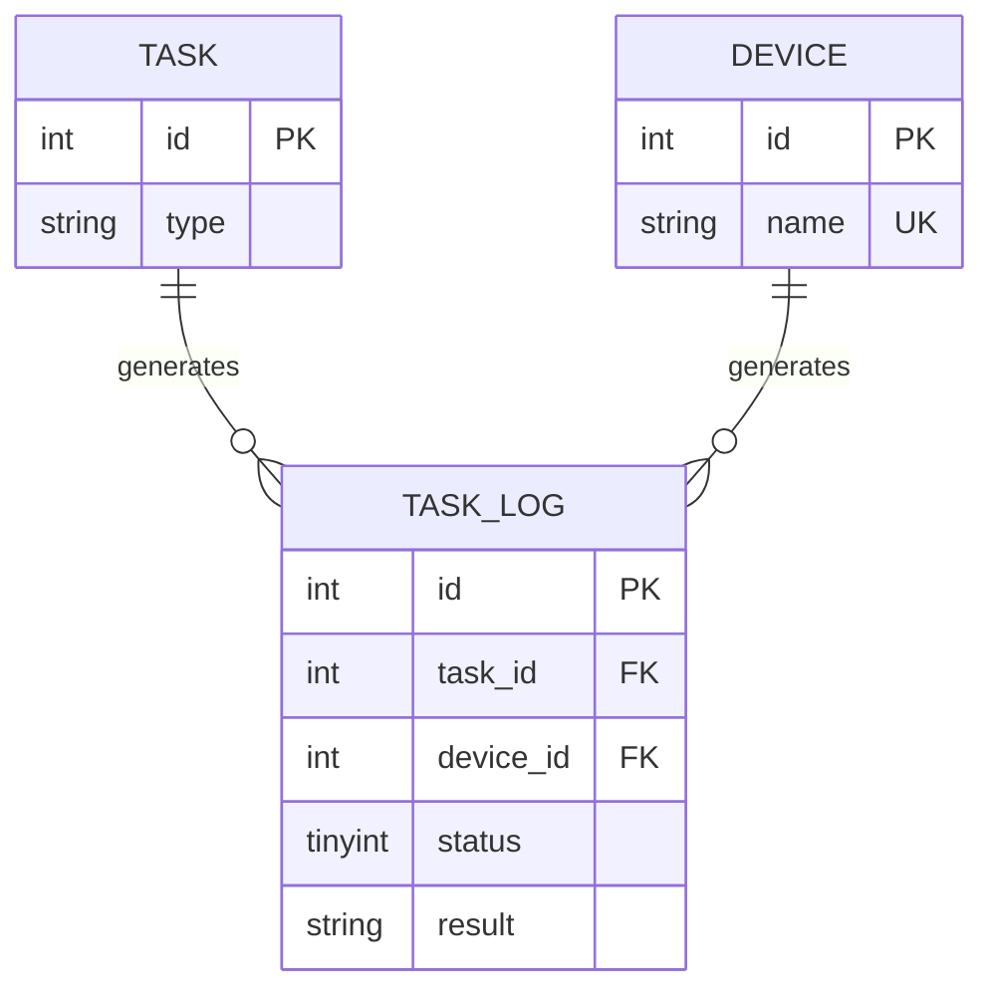
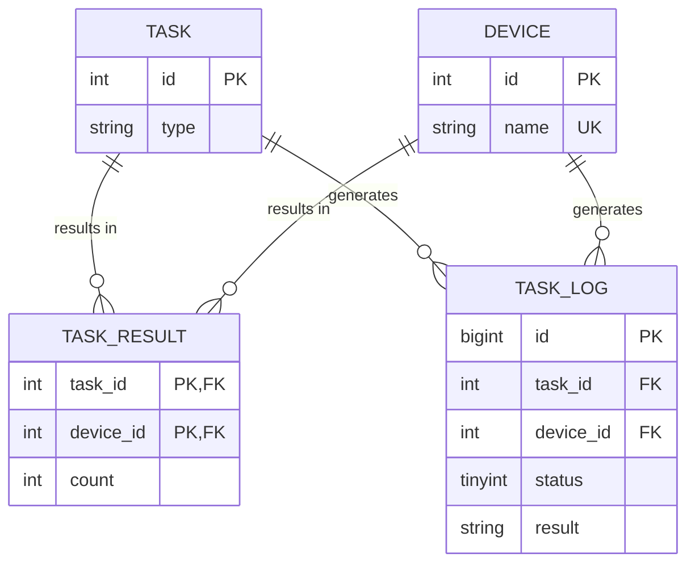

# 现实遭遇：生产环境的 INT 自增 ID 真的不够用了

 (image filpped). © [**willbrooks**](https://www.inaturalist.org/people/willbrooks). [*inaturalist.org*](https://www.inaturalist.org/photos/252142686).")

在 `INT` 类型不够用的案例中，我印象最深的是这个：[Gangnam Style broke YouTube's view counter](https://www.theverge.com/2014/12/3/7325819/gangnam-style-broke-youtube-view-counter)。不过 YouTube 团队在 [江南 Style (PSY - GANGNAM STYLE(강남스타일) M/V)](https://www.youtube.com/watch?v=9bZkp7q19f0) 的浏览量计数器真的溢出之前，及时将 32-bit `INT` 换成 64-bit `INT` 了。

题外话：上面提到的文章中说 "now not even a figure of `2,147,483,647` views is enough to contain..."，这个数字是 32-bit `SIGNED INT` 的上限。据说 YouTube 不使用 `UNSIGNED INT` 是因为 Google 的 C++ Style Guide 中规定 [^reddit][^gg_cpp_guide]：

[^reddit]: [Gangnam Style overflows INT_MAX, forces YouTube to go 64-bit](https://www.reddit.com/r/ProgrammerHumor/comments/2o9hrq/comment/cmlakqv/?utm_source=share&utm_medium=web2x&context=3)
[^gg_cpp_guide]: [Google C++ Style Guide - Integer Types](https://google.github.io/styleguide/cppguide.html#Integer_Types)

> You should not use the unsigned integer types such as `uint32_t`, unless there is a valid reason such as representing a bit pattern rather than a number, or you need defined overflow modulo 2^N. In particular, do not use unsigned types to say a number will never be negative. Instead, use assertions for this.

而 YouTube 的后端部分确实有使用 C++ [^ytb_pls]，所以这个说法是有可能的。

[^ytb_pls]: [Programming languages used in most popular websites](https://en.wikipedia.org/wiki/Programming_languages_used_in_most_popular_websites)

## 背景

在前一段时间，我发现负责的项目有一个 MySQL 表的自增 `INT` 主键 `id` 也即将到达上限 (`2,147,483,647`) 。那时主键值是 16 亿多，已经超过了容量的 76%，按照既有的增长速度预估 6-8 个月之后会到达上限。这个表是挺多年前设计的，我估计当时的开发人员也没料到数据规模会变成这个等级、项目会存续这么久。

我没处理过这种问题，但好在它不算紧急，还有几个月的时间可以做计划。所以我在搬砖之余，逐步梳理调研解决方案。

### 自增主键到达上限时会发生什么？

```sh
# host shell
docker run -it -e "MYSQL_ROOT_PASSWORD=123456" mysql:5.7 /bin/bash

# mysql container shell
service mysql start
mysql -uroot -p

# mysql client
mysql> create database test;
mysql> use test;
mysql> create table t(id int auto_increment primary key) auto_increment=2147483647;

mysql> insert into t values(null);
Query OK, 1 row affected (0.01 sec)

mysql> show create table t;
CREATE TABLE `t` (
  `id` int(11) NOT NULL AUTO_INCREMENT,
  PRIMARY KEY (`id`)
) ENGINE=InnoDB AUTO_INCREMENT=2147483647 DEFAULT CHARSET=latin1

mysql> insert into t values(null);
ERROR 1062 (23000): Duplicate entry '2147483647' for key 'PRIMARY'
```

可以看到，第一句 `insert` 执行后这个表的 `AUTO_INCREMENT` 值依然还是上限 `2147483647`。
因此，第二句 `insert` 拿到的自增 `id` 值依然是上限，所以执行结果是返回主键冲突错误。

### 表结构

以下是相关表的 ER 图（为了脱敏，和本文主题无关的表、字段都省略了），那个即将到达上限的表正是 `TASK_LOG` 表：



### 列数据类型变更

既然问题是因为 `INT` 类型的空间不够，那么把 `INT` 改为 `UNSIGNED BIGINT` 就可以了？

[^mysql_ol_ddl]: [14.13.1 Online DDL Operations - Column Operations](https://dev.mysql.com/doc/refman/5.7/en/innodb-online-ddl-operations.html#online-ddl-column-operations)
[^gt_delete_innodb]: [13 | 为什么表数据删掉一半，表文件大小不变？- 重建表](https://time.geekbang.org/column/article/72388)

**列数据类型变更 (Changing the column data type)** 的过程需要重建表 (Rebuilds Table) [^mysql_ol_ddl]。

MySQL 从 5.6 开始支持 Online DDL，并为 `ALTER` 语句引入了新的算法 `ALGORITHM=INPLACE`。这种新的“重建”发生在 InnoDB 内部，其过程大致如下 [^gt_delete_innodb]：

> 1. 建立一个临时文件，扫描表 A 主键的所有数据页；
> 2. 用数据页中表 A 的记录生成 B+ 树，存储到临时文件中；
> 3. 生成临时文件的过程中，将所有对 A 的操作记录在一个日志文件 (row log) 中；
> 4. 临时文件生成后，将日志文件中的操作应用到临时文件，得到一个逻辑数据上与表 A 相同的数据文件；
> 5. 用临时文件替换表 A 的数据文件。

显然，其中最耗时的部分是“拷贝”数据到临时的新表文件中。在这个过程中（当然，同时还要看具体 DDL 变更允许的 `LOCK` 类型），允许对表 A 做增删改操作，从而不中断正常的业务运行。

然而，列数据类型变更并不支持 `ALGORITHM=INPLACE`，且期间不允许 DML 操作 (❌ Permits Concurrent DML)，而只支持原有的 `ALGORITHM=COPY` [^mysql_ol_ddl]：

> Changing the column data type is only supported with ALGORITHM=COPY.

其实即使期间允许 DML 操作，由于上面提到的 `TASK_LOG` 表数据量太大，直接在生产环境做 Online DDL 也可能会因为消耗额外的 I/O 跟 CPU 而影响正常业务运行。

#### 其他工具

[ALTERing a Huge MySQL Table](https://mysql.rjweb.org/doc.php/alterhuge) 这篇文章中提到了两个 Online DDL 工具：

[^dl_ddl_vs_pt_ol]: [ONLINE DDL VS PT-ONLINE-SCHEMA-CHANGE](https://fromdual.com/online-ddl_vs_pt-online-schema-change)
[^cmp_ol_tools]: [Comparison of Online Schema Change tools](https://planetscale.com/docs/learn/online-schema-change-tools-comparison)

- [pt-online-schema-change](https://docs.percona.com/percona-toolkit/pt-online-schema-change.html) 实现的变更过程大致如下 [^dl_ddl_vs_pt_ol]：
  1. 创建一个结构和原表一样的新表；
  2. 对新表做期望的变更；
  3. 对原表创建触发器，使拷贝数据过程中所有的数据变更都应用到新的表上；
  4. 从原表拷贝数据到新表；
  5. 改变原表的名称、将新表重命名为原表名，最后丢弃原表。
- [github/gh-ost](https://github.com/github/gh-ost) 对原表数据变更的追踪不是使用触发器，而是 MySQL 的 binlog。它不是直接从磁盘读取 binlog，而是使自己以从库的身份去接收 binlog [^cmp_ol_tools]。

[^pt_ol_ct]: [pt-online-schema-change - OPTIONS](https://docs.percona.com/percona-toolkit/pt-online-schema-change.html#cmdoption-pt-online-schema-change-chunk-time)

这类工具相较于 MySQL Online DDL 的优势在于，它们对 Online DDL 操作类型的支持更全面，同时可以根据生产环境系统资源的使用情况去调整数据拷贝粒度，以尽可能减小对生产环境的影响 [^dl_ddl_vs_pt_ol][^pt_ol_ct]。

补充：在 [Comparison of Online Schema Change tools](https://planetscale.com/docs/learn/online-schema-change-tools-comparison) 这篇文章中除了上面提到的两个工具，还额外对比了 [facebookincubator/OnlineSchemaChange](https://github.com/facebookincubator/OnlineSchemaChange) 和 [Vitess](https://vitess.io/docs/19.0/user-guides/schema-changes/) 这几个工具的设计与实现思路。

### 好消息

`TASK_LOG` 这个表是一个“日志类”的数据表，记录每台设备执行某个任务的结果。当任务执行失败时，它记录的错误信息可用于诊断出错原因。而那些执行成功的任务记录，以及已经过去很久的失败记录，从业务角度来说其实已经失去其原有的用途，可以直接丢弃。项目其他相关人员也确认那些老日志可以丢弃。

如此一来，最耗时的拷贝数据环节其实是可以节省大量时间的，只需要保留当前真正需要的数据。

### 坏消息

从上面的 ER 图可以看出，任务的执行状态是由 `TASK_LOG` 的 `status` 字段记录的，用来防止已成功执行任务的设备重复执行相同的任务。也就是说，现阶段不能简单地把历史日志丢弃了事……

## 方案

事到如今，不重构已经不行了：`TASK_LOG` 中的 `status` 应该额外记录到独立的表中，使 `TASK_LOG` 成为一个真正意义上的日志表——随时可丢弃。

### 新的表结构

`TASK_RESULT` 中的 `count` 表示任务成功执行的次数。



### 实施步骤

#### 1. 新增 `TASK_RESULT` 表

- 新增 `TASK_RESULT` 表
- 将每台设备的任务执行结果保存到这个表的 `count` 字段

从以上变更上线的 `时刻 A` 起，`TASK_RESULT` 就保存了所有后续的执行结果。

#### 2. 从 `TASK_LOG` 表收集历史执行结果

- 先删除清理任务列表中过时的任务，以减少需要搬运的数据量
- 以任务为单位，将 `TASK_LOG` 中设备的执行结果收集保存到 `TASK_RESULT` 中

这一步写了单独的工具脚本，为了尽量不影响生产环境，所以收集的速度也设置得比较慢。这个脚本在后台跑了两三天。

#### 3. 应用代码不再使用 `TASK_LOG` 表作为判断依据

当脚本跑到 `时刻 A` 的数据记录时，`TASK_RESULT` 表的数据就已经是完备的了。此时 `TASK_LOG` 功成身退，成为一个纯粹的日志表。

所以，应用代码中判定某台设备是否需要执行某个任务可以完全只依赖于 `TASK_RESULT` 表。

#### 4. 数据库切换新的 `TASK_LOG` 表

- 新建 `TASK_LOG_NEW` 表（`id` 字段更新为 `unsigned bigint`）
- 重命名 `TASK_LOG` 表为 `TASK_LOG_OLD`，并将 `TASK_LOG_NEW` 重命名为 `TASK_LOG`

#### 5. 清理原 `TASK_LOG_OLD` 表

`TASK_LOG_OLD` 已经变成可以随时 `DROP` 的表，不过里面的日志内容可能还需要随时查阅。在等了数个月之后，我才准备将其从生产数据库中移除。

对于一个大表来说直接 `DROP` 是很危险的，具体请看：[Why you simply don't drop a huge InnoDB table in production...](https://dev.to/jung/why-you-simply-don-t-drop-a-huge-innodb-table-in-production-18j2)

[^dont_simply_drop]: [Why you simply don't drop a huge InnoDB table in production...](https://dev.to/jung/why-you-simply-don-t-drop-a-huge-innodb-table-in-production-18j2)

> A `DROP` statement in MySQL locks the `LOCK_open` mutex causing almost all other threads to hang until the statement is completed, most of all because the table needs to be removed from the shared **Table Definition Cache (TDC)** and this is the mutex used to serialize the TDC updates. [^dont_simply_drop]

目前并没有找到 100% 安全高效的移除大表的方案，但上文中提到的 "was stuck for another 50 secs" 问题我并没有遇到（数据量级差不多），有可能是因为这个项目的 MySQL 实例并发数没有人家那样高而没触发问题。执行流程大致如下：

- 按索引逐个执行 `DROP INDEX index_name ON TASK_LOG_OLD;`
- 使用工具脚本循环执行（也是为了控制速率）：`DELETE FROM TASK_LOG_OLD LIMIT 1000;`
- `OPTIMIZE TABLE TASK_LOG_OLD;`
- `DROP TABLE TASK_LOG_OLD;`

补充一个 hack 方案（未尝试）：[Speed Up Your Large Table Drops in MySQL](https://www.percona.com/blog/speed-up-your-large-table-drops-in-mysql/)

### 后续措施

以上措施有点救火的性质，属于不得不做。长远来看，`TASK_LOG` 的数据有明显的时效性，过去太久的数据没意义，没必要留着占用空间。这部分完全可以做成自动归档自动丢弃，或者干脆将这些日志存在其他类型的存储而不是在同一个 MySQL 实例里，这样还可以分走一些数据库负载压力。

不过由于日常其他搬砖活太多了，目前只是简单调研了一些方案，还没制定好具体计划。

- [PARTITION Maintenance in MySQL - PARTITION Maintenance for the Time-Series Case](https://mysql.rjweb.org/doc.php/partitionmaint#partition_maintenance_for_the_time_series_case)
- [MongoDB Time Series Data](https://www.mongodb.com/features/mongodb-time-series-data)

## Cover

::: details Sakila

[{.inline-img}](https://www.mysql.com/)

MySQL 的 Logo[^logo] 是一只名为 "Sakila" 的海豚 [^sakila]。不过 Sakila 单纯只是一个海豚图形，并不具体对应某一只真实的海豚，甚至连是哪个海豚物种也不确定。

[^logo]: [MySQL Logo Downloads](https://www.mysql.com/about/legal/logos.html)
[^sakila]: [1.2.3 History of MySQL](https://dev.mysql.com/doc/refman/8.0/en/history.html)

封面图是我见过的最像 Sakila 的一只海豚，它是一只**真海豚 (Common Dolphin)**[^common_dolphin]，也译为**普通海豚**。

[^common_dolphin]: [Common dolphin](https://en.wikipedia.org/wiki/Common_dolphin)

:::
