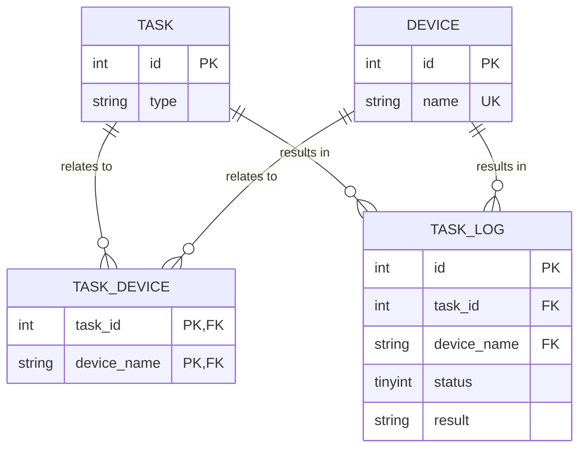

# 现实遭遇：生产环境的 INT 自增 ID 真的不够用了

 (image filpped). © [**willbrooks**](https://www.inaturalist.org/people/willbrooks). [*inaturalist.org*](https://www.inaturalist.org/photos/252142686).")

在 INT 类型不够用的案例中，我印象最深的是这个：[Gangnam Style broke YouTube's view counter](https://www.theverge.com/2014/12/3/7325819/gangnam-style-broke-youtube-view-counter)。不过 YouTube 团队在 [江南 Style (PSY - GANGNAM STYLE(강남스타일) M/V)](https://www.youtube.com/watch?v=9bZkp7q19f0) 的浏览量计数器真的溢出之前，及时将 32-bit INT 换成 64-bit INT 了。

题外话：上面提到的文章中说 "now not even a figure of `2,147,483,647` views is enough to contain..."，这个数字是 32-bit SIGNED INT 的上限。 据说 YouTube 不使用 UNSIGNED INT 是因为 Google 的 C++ Style Guide 中规定 [^reddit][^gg_cpp_guide]：

[^reddit]: [Gangnam Style overflows INT_MAX, forces YouTube to go 64-bit](https://www.reddit.com/r/ProgrammerHumor/comments/2o9hrq/comment/cmlakqv/?utm_source=share&utm_medium=web2x&context=3)
[^gg_cpp_guide]: [Google C++ Style Guide - Integer Types](https://google.github.io/styleguide/cppguide.html#Integer_Types)

> You should not use the unsigned integer types such as `uint32_t`, unless there is a valid reason such as representing a bit pattern rather than a number, or you need defined overflow modulo 2^N. In particular, do not use unsigned types to say a number will never be negative. Instead, use assertions for this.

而 YouTube 的后端部分确实有使用 C++ [^ytb_pls]，所以这个说法是有可能的。

[^ytb_pls]: [Programming languages used in most popular websites](https://en.wikipedia.org/wiki/Programming_languages_used_in_most_popular_websites)

## 背景

在前一段时间，我发现负责的项目有一个 MySQL 表的自增 `INT` 主键 `id` 也即将到达上限 (`2,147,483,647`) 。那时主键值是 16 亿多，已经超过了容量的 76%，按照现有的增长速度预估 6-8 个月之后会到达上限。这个表是挺多年前设计的，我估计当时的开发人员也没料到数据规模会变成这个等级、项目会存续这么久。

我没处理过这种问题，但好在它不算紧急，还有几个月的时间可以做计划。所以我在搬砖之余，逐步梳理调研解决方案。

### 表结构

以下是相关表的 ER 图（为了脱敏，和本文主题无关的表、字段都省略了），那个即将到达上限的表正是 `TASK_LOG` 表：



### 自增主键到达上限时会发生什么？

```sh
# host shell
docker run -it -e "MYSQL_ROOT_PASSWORD=123456" mysql:5.7 /bin/bash

# mysql container shell
service mysql start
mysql -uroot -p

# mysql client
mysql> create database test;
mysql> use test;
mysql> create table t(id int auto_increment primary key) auto_increment=2147483647;

mysql> insert into t values(null);
Query OK, 1 row affected (0.01 sec)

mysql> show create table t;
CREATE TABLE `t` (
  `id` int(11) NOT NULL AUTO_INCREMENT,
  PRIMARY KEY (`id`)
) ENGINE=InnoDB AUTO_INCREMENT=2147483647 DEFAULT CHARSET=latin1

mysql> insert into t values(null);
ERROR 1062 (23000): Duplicate entry '2147483647' for key 'PRIMARY'
```

可以看到，第一句 `insert` 执行后这个表的 `AUTO_INCREMENT` 值依然还是上限 `2147483647`。
因此，第二句 `insert` 拿到的自增 `id` 值依然是上限，所以执行结果是返回主键冲突错误。

### 列数据类型变更

既然问题是因为 `INT` 类型的空间不够，那么把 `INT` 改为 `UNSIGNED BIGINT` 就可以了？

[^mysql_ol_ddl]: [14.13.1 Online DDL Operations - Column Operations](https://dev.mysql.com/doc/refman/5.7/en/innodb-online-ddl-operations.html#online-ddl-column-operations)
[^rebuild]: [13 | 为什么表数据删掉一半，表文件大小不变？ - 重建表](https://time.geekbang.org/column/article/72388)

**列数据类型变更 (Changing the column data type)** 的过程需要重建表 (Rebuilds Table) [^mysql_ol_ddl]。MySQL 从 5.6 开始支持 Online DDL，这种新的 (`ALGORITHM=INPLACE`) 重建方式过程大致如下 [^rebuild]：

> 1. 建立一个临时文件，扫描表 A 主键的所有数据页；
> 2. 用数据页中表 A 的记录生成 B+ 树，存储到临时文件中；
> 3. 生成临时文件的过程中，将所有对 A 的操作记录在一个日志文件 (row log) 中；
> 4. 临时文件生成后，将日志文件中的操作应用到临时文件，得到一个逻辑数据上与表 A 相同的数据文件；
> 5. 用临时文件替换表 A 的数据文件。

显然，其中最耗时的部分是“拷贝”数据到临时的新表文件中。在这个过程中，允许对表 A 做增删改操作，从而不中断正常的业务运行。

然而，列数据类型变更并不支持 `ALGORITHM=INPLACE`，而只支持原有的 `ALGORITHM=COPY` [^mysql_ol_ddl]：

> Changing the column data type is only supported with ALGORITHM=COPY.

即使支持 `ALGORITHM=INPLACE`，由于上面提到的 `TASK_LOG` 表数据量太大，直接在生产环境做 Online DDL 也会因为消耗额外的 I/O 跟 CPU 而影响正常业务运行。

#### 其他工具

>>>>>

### 好消息

这个表是一个“日志类”的数据表。

### 坏消息

## 方案

> 任务执行结果标记字段不设在 `TASK_DEVICE` 表中是有其他业务原因，不在本文讨论范围。

## 后续措施

---

::: details MySQL Logo

MySQL 的 Logo[^logo] 是一只名为 "Sakila" 的海豚 [^sakila]。不过 Sakila 单纯只是一个海豚图形，并不具体对应某一只真实的海豚，甚至连是哪个海豚物种也不确定。

[^logo]: [MySQL Logo Downloads](https://www.mysql.com/about/legal/logos.html)
[^sakila]: [1.2.3 History of MySQL](https://dev.mysql.com/doc/refman/8.0/en/history.html)

封面图是我见过的最像 MySQL Logo 的一只海豚，它是一只**真海豚 (Common Dolphin)**[^common_dolphin]，也译为**普通海豚**。

[^common_dolphin]: [Common dolphin](https://en.wikipedia.org/wiki/Common_dolphin)

:::
