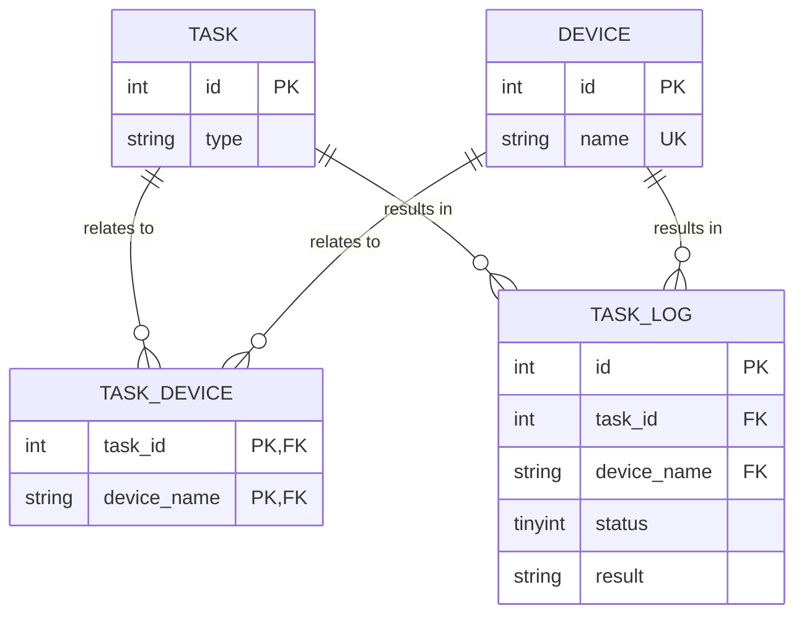

# 现实遭遇：生产环境的 INT 自增 ID 真的不够用了

 (image filpped). © [**willbrooks**](https://www.inaturalist.org/people/willbrooks). [*inaturalist.org*](https://www.inaturalist.org/photos/252142686).")

在 INT 类型不够用的案例中，我印象最深的是这个：[Gangnam Style broke YouTube's view counter](https://www.theverge.com/2014/12/3/7325819/gangnam-style-broke-youtube-view-counter)。不过 YouTube 团队在 [江南 Style (PSY - GANGNAM STYLE(강남스타일) M/V)](https://www.youtube.com/watch?v=9bZkp7q19f0) 的浏览量计数器真的溢出之前，及时将 32-bit INT 换成 64-bit INT 了。

题外话：上面提到的文章中说 "now not even a figure of `2,147,483,647` views is enough to contain..."，这个数字是 32-bit SIGNED INT 的上限。 据说 YouTube 不使用 UNSIGNED INT 是因为 Google 的 C++ Style Guide 中规定 [^reddit][^gg_cpp_guide]：

[^reddit]: [Gangnam Style overflows INT_MAX, forces YouTube to go 64-bit](https://www.reddit.com/r/ProgrammerHumor/comments/2o9hrq/comment/cmlakqv/?utm_source=share&utm_medium=web2x&context=3)
[^gg_cpp_guide]: [Google C++ Style Guide - Integer Types](https://google.github.io/styleguide/cppguide.html#Integer_Types)

> You should not use the unsigned integer types such as `uint32_t`, unless there is a valid reason such as representing a bit pattern rather than a number, or you need defined overflow modulo 2^N. In particular, do not use unsigned types to say a number will never be negative. Instead, use assertions for this.

而 YouTube 的后端部分确实有使用 C++ [^ytb_pls]，所以这个说法是有可能的。

[^ytb_pls]: [Programming languages used in most popular websites](https://en.wikipedia.org/wiki/Programming_languages_used_in_most_popular_websites)

## 背景

在前一段时间，我发现负责的项目有一个 MySQL 表的自增 INT 主键 `id` 也即将到达上限 (`2,147,483,647`) 。那时主键值是 16 亿多，已经超过了容量的 76%，按照现有的增长速度预估 6-8 个月之后会到达上限。这个表是挺多年前设计的，我估计当时的开发人员也没料到数据规模会变成这个等级、项目会存续这么久。

我没处理过这种问题，但好在它不算紧急，还有几个月的时间可以做计划。所以我在搬砖之余，逐步梳理调研解决方案。

### 表结构

以下是相关表的 ER 图（为了脱敏，和本文主题无关的表、字段都省略了）：

#### 好消息

- <https://github.com/percona/percona-toolkit>

#### 坏消息

这个表是一个“日志类”的数据表。

- <https://time.geekbang.org/column/article/83183>
- <https://dev.mysql.com/doc/refman/8.0/en/example-auto-increment.html>

## 方案

## 后续措施

---

::: details MySQL Logo

MySQL 的 Logo[^logo] 是一只名为 "Sakila" 的海豚 [^sakila]。不过 Sakila 单纯只是一个海豚图形，并不具体对应某一只真实的海豚，甚至连是哪个海豚物种也不确定。

[^logo]: [MySQL Logo Downloads](https://www.mysql.com/about/legal/logos.html)
[^sakila]: [1.2.3 History of MySQL](https://dev.mysql.com/doc/refman/8.0/en/history.html)

封面图是我见过的最像 MySQL Logo 的一只海豚，它是一只**真海豚 (Common Dolphin)**[^common_dolphin]，也译为**普通海豚**。

[^common_dolphin]: [Common dolphin](https://en.wikipedia.org/wiki/Common_dolphin)

:::
