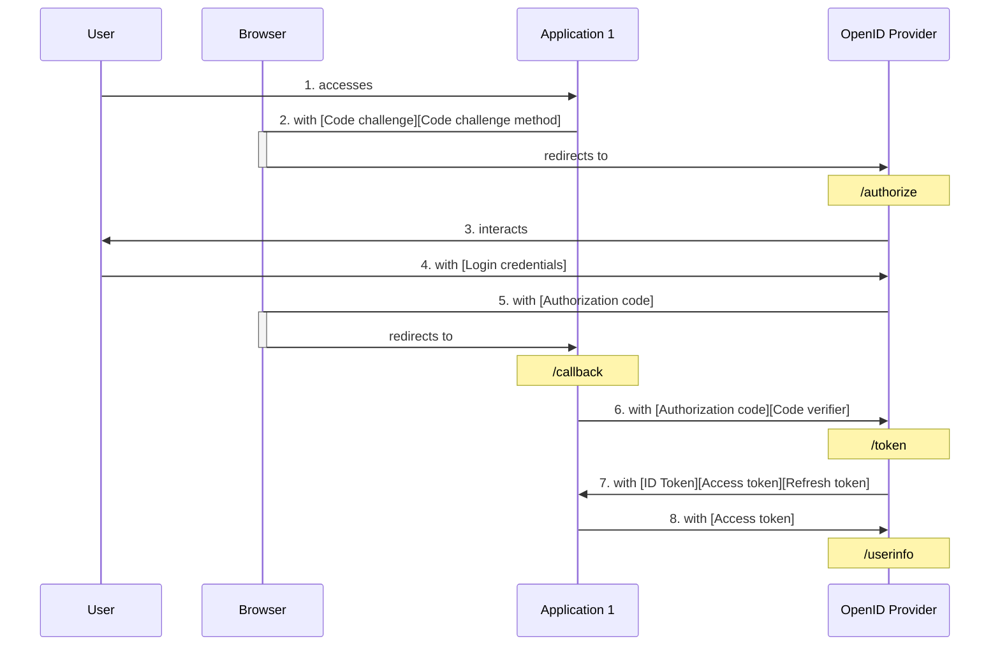
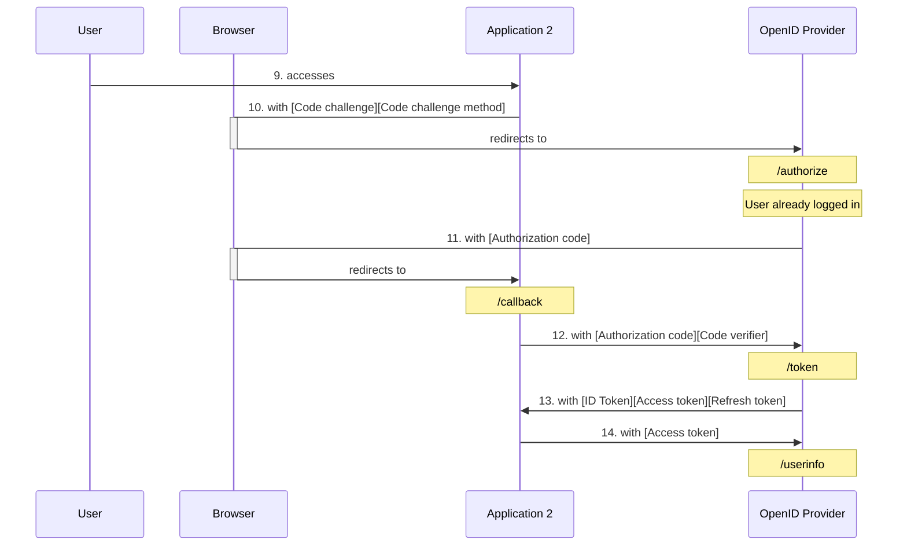
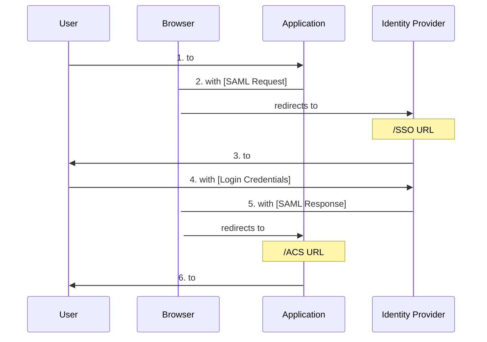

# 单点登录 (Single Sign-On) 身份验证

 (image resized). © [**liamkmc**](https://www.inaturalist.org/people/liamkmc). [*inaturalist.org*](https://www.inaturalist.org/photos/106254096).")

最近参与的项目涉及到单点登录相关的功能，得以顺便补一些这方面的知识。虽然自己平时作为用户也没少用到单点登录，但对实现它的细节并没有概念。本文总结单点登录流程中的一些关键点。

## 基本概念

- **authentication (认证)**：验证一个人身份的过程，最常见的就是“账号登录”。
- **authorization (授权)**：验证一个人是否有权限执行某些操作的过程。

"authentication" 和 "authorization" 这俩单词的该死之处在于，前四个字母都是 auth，而 auth 经常被作为缩写使用，因而很容易被混淆。

比如 OAuth[^oauth]，如果没有了解过它，单看名字你能判断它的 "Auth" 是指 Authentication 还是 Authorization 吗？显然不能。只有在了解 OAuth 之后，才能搞清楚它是用于 Authorization。更具体地说，OAuth 提供了一个标准的流程：将 `实体 1`（如用户）在 `实体 2`（如某网站）拥有的某些权限授予 `实体 3`（如第三方网站）[^oauth_simp]。

[^oauth]: [OAuth Community Site](https://oauth.net/)
[^oauth_simp]: [OAuth 2 Simplified](https://aaronparecki.com/oauth-2-simplified/)

单点登录显然属于 authentication。

## 主流协议

目前应用比较广泛的支持 SSO 的开放标准主要有 **OIDC (OpenID Connect)**[^oidc] 和 **SAML (Security Assertion Markup Language) 2.0**[^saml]。OIDC 是基于 OAuth 2.0 的认证协议，它在 OAuth 的流程之上，增加了认证用户的标准化步骤 [^oidc_how]。而 SAML 在此之前我并没听说过，这个标准似乎在企业用户领域应用得比较多。比如 GitHub 关于 SAML 的文档也是归类在 Enterprise Cloud 中 [^gh_saml]。

[^oidc]: [OpenID Connect Core 1.0](https://openid.net/specs/openid-connect-core-1_0-final.html)
[^saml]: [Security Assertion Markup Language (SAML) v2.0](https://www.oasis-open.org/standard/saml/)
[^oidc_how]: [What is OpenID Connect](https://openid.net/developers/how-connect-works/)
[^gh_saml]: [Authenticating with SAML single sign-on](https://docs.github.com/en/enterprise-cloud@latest/authentication/authenticating-with-saml-single-sign-on)

## 典型流程

不管是 OIDC 还是 SAML，它们的运作流程都有一个相似的模式：多个应用使用同一个中心化的认证服务进行账户认证，正是这个中心化的认证服务提供了单点登录需要的用户认证状态。一个典型的流程（以 OIDC Authorization Code Flow[^oidc_code_flow] 为例）如下：

[^oidc_code_flow]: [3.1. Authentication using the Authorization Code Flow](https://openid.net/specs/openid-connect-core-1_0-final.html#CodeFlowAuth)

假设用户还没在认证服务 OpenID Provider 登录：

之后，用户又访问了 Application 2：

### 涉及角色

- `User`
- `Browser`
- `OpenID Provider`
- `Application 1`
- `Application 2`

### 详细说明

1. 用户 `User` 访问 `Application 1`（在 OIDC 中，依赖 叫 "Relying Party"）。
2. The user’s browser redirected to the `OpenID Provider` with an
   `authentication request`.
3. The `OpenID Provider` interacts with the user for authentication and to
   obtain consent for the scope of user info request.
4. The user authenticates and gives consent, and the `OpenID Provider` creates
   or updates an authentication session for the user.
5. The user’s browser redirected back to the `application` with
   `authorization code`.
6. The `application` sends a token request to the `OpenID Provider`, with the
   `authorization code`.
7. The `OpenID Provider` responds with an `ID Token`, `access token`, and
   optionally a `refresh token`.
8. The `application` can use the `access token` at the `OpenID Provider`’s
   UserInfo endpoint.

The second call to the token endpoint to obtain the security tokens assumes the
application has the ability to authenticate itself to the `OpenID Provider`.
`Public client` applications that cannot securely maintain a `secret` for such
authentication can use `Proof Key for Code Exchange (PKCE)`. The use of PKCE is
designed to mitigate the risk of an `authorization code` being intercepted by
an unauthorized party. The following sample requests assume the use of PKCE.

### SP-Initiated SSO

In the example below, the user starts at the `service provider (SP)`
(application) so it is known as the `SP-initiated flow`. This is called
“SP-initiated” because the user initiates the interaction at the
`service provider (SP)`. It is the simplest form of cross-domain single
sign-on:

1. The user visits a `service provider` (application).
2. The `service provider` redirects the user’s browser to the
   `identity provider` with a SAML authentication request.
3. The `identity provider` interacts with the user for authentication.
4. The user authenticates. The `identity provider` validates credentials.
5. The `identity provider` redirects the user’s browser back to the
   `service provider` with a SAML response containing a SAML authentication
   assertion. The response is sent to the `service provider`’s Assertion
   Consumer Service (ACS) URL.
6. The `service provider` consumes and validates the SAML response and
   responds to the user’s original request (assuming the user was successfully
   authenticated and has sufficient privileges for the request).

## 单点登出（Single Logout）

:::details Salish Sea Orcas

封面图是一头萨利希海 (Salish Sea)[^salish_sea] 虎鲸 (Orca)[^orca] 在呼吸时喷出水雾。

[^salish_sea]: [Salish Sea](https://en.wikipedia.org/wiki/Salish_Sea)
[^orca]: [Orca](https://en.wikipedia.org/wiki/Orca)

 (image resized). © [**Antonio Flores**](https://www.inaturalist.org/people/antonioflores). [*inaturalist.org*](https://www.inaturalist.org/photos/70768468).")

:::

- <https://www.orcanetwork.org/orca-resource-center/orcas-of-the-salish-sea>
- <https://davidsuzuki.org/what-you-can-do/get-to-know-the-salish-sea-orcas/>
