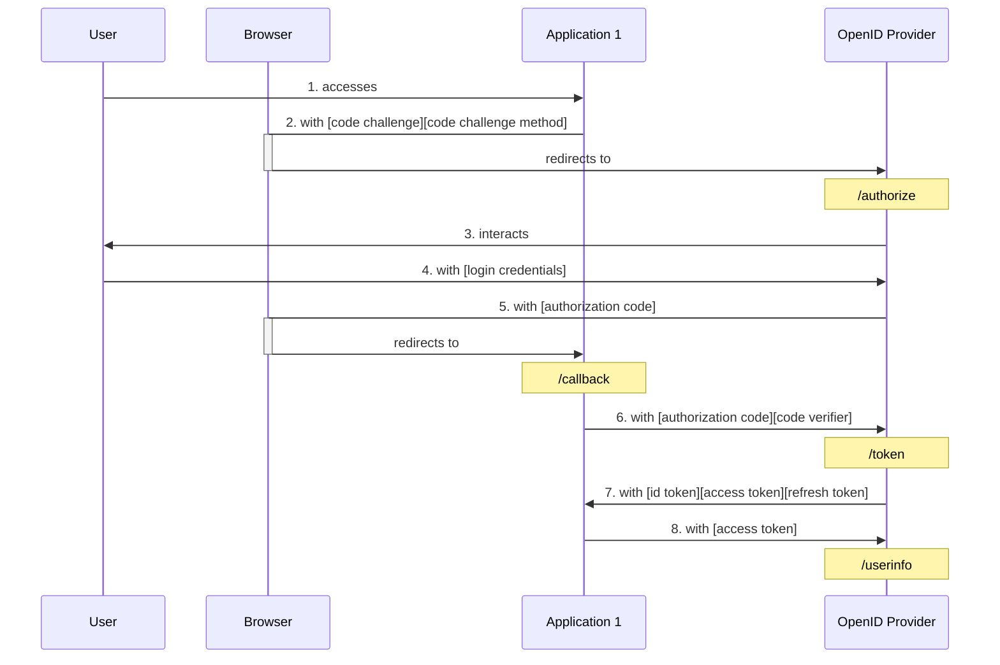
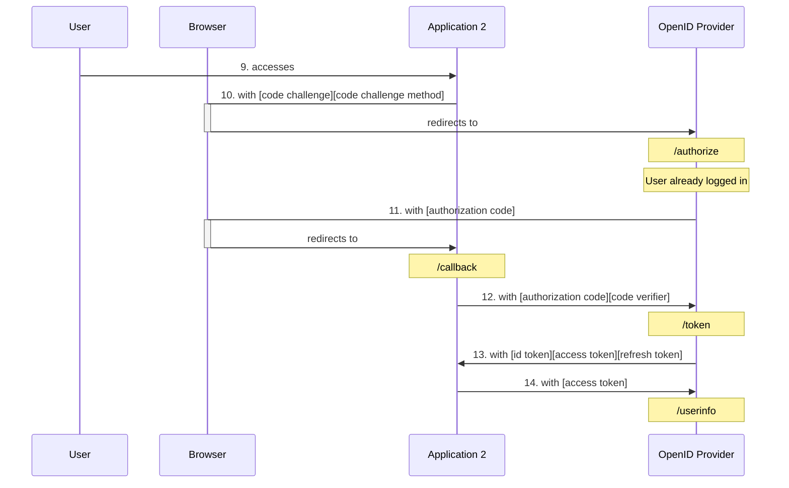
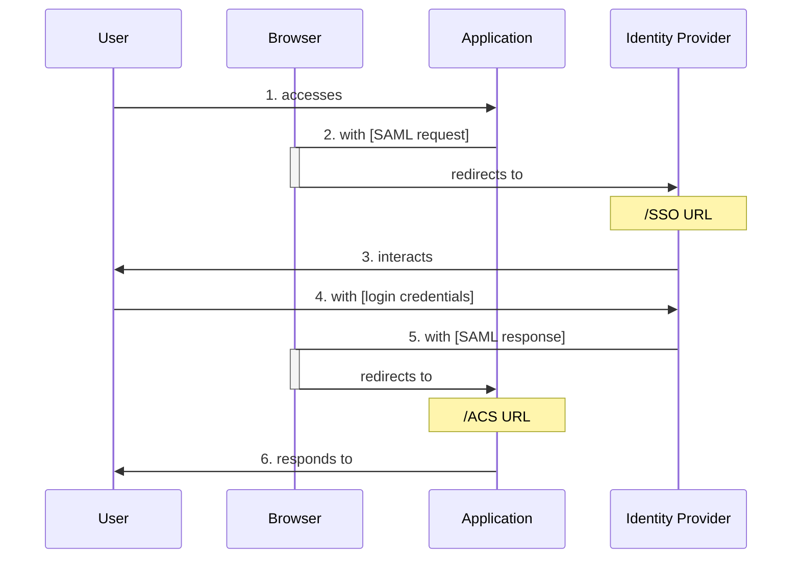

# 单点登录 (Single Sign-On) 身份验证

 (image resized). © [**liamkmc**](https://www.inaturalist.org/people/liamkmc). [*inaturalist.org*](https://www.inaturalist.org/photos/106254096).")

最近参与的项目涉及到单点登录相关的功能，得以顺便补一些这方面的知识。虽然自己平时作为用户也没少用到单点登录，但对实现它的方案并没有概念。本文总结单点登录流程中的一些关键点。

## 基本概念

- **authentication (认证)**：验证一个人身份的过程，最常见的就是“账号登录”。
- **authorization (授权)**：验证一个人是否有权限执行某些操作的过程。

"authentication" 和 "authorization" 这俩单词的该死之处在于，前四个字母都是 auth，而 auth 经常被作为缩写使用，因而很容易被混淆。

比如 OAuth[^oauth]，如果没有了解过它，单看名字你能判断它的 "Auth" 是指 Authentication 还是 Authorization 吗？显然不能。只有在了解 OAuth 之后，才能搞清楚它是用于 Authorization。更具体地说，OAuth 提供了一个标准的流程：将 `实体 1`（如用户）在 `实体 2`（如某网站）拥有的某些权限授予 `实体 3`（如第三方网站）[^oauth_simp]。

[^oauth]: [OAuth Community Site](https://oauth.net/)
[^oauth_simp]: [OAuth 2 Simplified](https://aaronparecki.com/oauth-2-simplified/)

单点登录显然属于 authentication。

## 主流协议

目前应用比较广泛的支持 SSO 的开放标准主要有 **OIDC (OpenID Connect)**[^oidc] 和 **SAML (Security Assertion Markup Language) 2.0**[^saml]。OIDC 是基于 OAuth 2.0 的认证协议，它在 OAuth 的流程之上，增加了认证用户的标准化步骤 [^oidc_how]。而 SAML 在此之前我并没听说过，这个标准似乎在企业用户领域应用得比较多。比如 GitHub 关于 SAML 的文档也是归类在 Enterprise Cloud 中 [^gh_saml]。

[^oidc]: [OpenID Connect Core 1.0](https://openid.net/specs/openid-connect-core-1_0-final.html)
[^saml]: [Security Assertion Markup Language (SAML) v2.0](https://www.oasis-open.org/standard/saml/)
[^oidc_how]: [What is OpenID Connect](https://openid.net/developers/how-connect-works/)
[^gh_saml]: [Authenticating with SAML single sign-on](https://docs.github.com/en/enterprise-cloud@latest/authentication/authenticating-with-saml-single-sign-on)

## 典型流程

不管是 OIDC 还是 SAML，它们的运作流程都有一个相似的模式：多个应用使用同一个中心化的认证服务进行账户认证，正是这个中心化的认证服务提供了单点登录需要的用户认证状态。一个典型的流程（以 OIDC Authorization Code Flow[^oidc_code_flow] 为例）如下：

[^oidc_code_flow]: [OpenID Connect Core 1.0 - 3.1. Authentication using the Authorization Code Flow](https://openid.net/specs/openid-connect-core-1_0-final.html#CodeFlowAuth)

假设用户还没有登录：

之后，用户又访问 Application 2：

### 涉及角色

- `User`：用户。
- `Browser`：浏览器。
- `OpenID Provider`：认证服务，所有接入的应用程序都将其作为用户登录入口。
- `Application 1`：应用程序 1，是 `OpenID Provider` 的客户端 (Client)。在 OIDC 中 `OpenID Provider` 的客户端统称为 **Relying Party**[^rely_party]。
- `Application 2`：应用程序 2。

[^rely_party]: [OpenID Connect Core 1.0 - 1.2. Terminology](https://openid.net/specs/openid-connect-core-1_0-final.html#Terminology)

### 过程说明

1. `User` 访问 `Application 1`（此时用户未在 `Application 1` 登录）；
2. `Application 1` 发出认证请求：将 `Browser` 重定向到 `OpenID Provider` 的 `/authorize` 接口（此时用户未在 `OpenID Provider` 登录）；
    - `code challenge` 与 `code challenge method` 用于 PKCE (Proof Key for Code Exchange) 校验[^pkce]；
    - **PKCE** 是对 **OAuth 2.0 Authorization Code Grant**[^auth_code_flow] 的扩展，用于防止 CSRF 和 Authorization Code 注入攻击 [^why_pkce]。
3. `OpenID Provider` 与 `User` 交互，认证 `User` 并询问 `User` 是否允许将其用户信息授权给 `Application 1`；
4. `User` 输入登录信息，`OpenID Provider` 更新 `User` 的 session 信息；
    - 此处假设 `Application 1` 受 `OpenID Provider` 信任，省略了获取 `User` 同意授权的步骤；
5. `Browser` 带着 `OpenID Provider` 生成的 `authorization code` 重定向回 `Application 1` 的 `/callback` 接口；
6. `Application 1` 发出 `token` 请求到 `OpenID Provider` 的 `/token` 接口；
    - `code verifier` 也是用于 PKCE 校验[^pkce]；
    - 这个步骤 `Application 1` 本身也需要认证 [^client_auth]。
7. `OpenID Provider` 返回 `id token`、`access token` 和 `refresh token`（可选）；
8. `Application 1` 使用 `access token` 从 `OpenID Provider` 的 `/userinfo` 获取用户信息。

`9.`~`14.` 的过程类似，由于 `User` 已经在 `OpenID Provider` 登录，所以用户不再需要输入登录信息就可以自动登录 `Application 2`。

[^pkce]: [RFC 7636, Proof Key for Code Exchange by OAuth Public Clients](https://www.rfc-editor.org/rfc/rfc7636)
[^auth_code_flow]: [OAuth 2.0 Authorization Code Grant](https://oauth.net/2/grant-types/authorization-code/)
[^why_pkce]: [RFC 7636: Proof Key for Code Exchange](https://oauth.net/2/pkce/)
[^client_auth]: [RFC 6749, The OAuth 2.0 Authorization Framework - 3.2. Token Endpoint](https://datatracker.ietf.org/doc/html/rfc6749#section-3.2)

### SAML SP-Initiated SSO

SAML 的 SSO 流程也十分相似，核心是将认证步骤集中在认证服务（在 SAML 中称为 Identity Provider）：

## 单点登出（Single Logout）

:::details Salish Sea Orcas

封面图是一头萨利希海 (Salish Sea)[^salish_sea] 虎鲸 (Orca)[^orca] 在呼吸时喷出水雾。

[^salish_sea]: [Salish Sea](https://en.wikipedia.org/wiki/Salish_Sea)
[^orca]: [Orca](https://en.wikipedia.org/wiki/Orca)

 (image resized). © [**Antonio Flores**](https://www.inaturalist.org/people/antonioflores). [*inaturalist.org*](https://www.inaturalist.org/photos/70768468).")

:::

- <https://www.orcanetwork.org/orca-resource-center/orcas-of-the-salish-sea>
- <https://davidsuzuki.org/what-you-can-do/get-to-know-the-salish-sea-orcas/>
