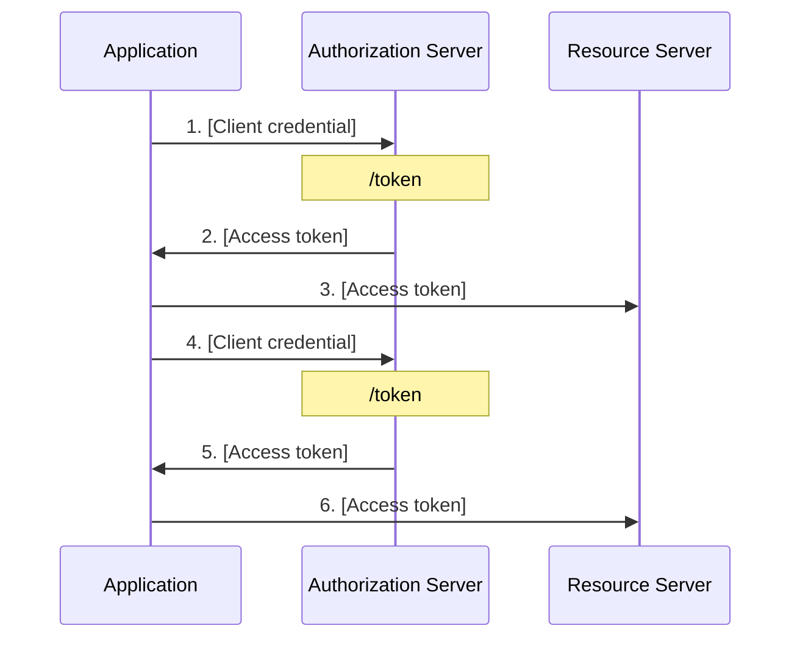

# 单点登录 (Single Sign-On) 身份验证

 (image resized). © [**liamkmc**](https://www.inaturalist.org/people/liamkmc). [*inaturalist.org*](https://www.inaturalist.org/photos/106254096).")

最近参与的项目涉及到单点登录相关的功能，因此补了一些这方面的知识。虽然自己平时作为用户也没少用到单点登录，但对实现它的细节并不清楚。本文总结单点登录流程中的一些关键点。

## 基本概念

- **authentication (认证)**：验证一个人身份的过程，最常见的就是“账号登录”。
- **authorization (授权)**：验证一个人是否有权限执行某些操作的过程。

"authentication" 和 "authorization" 这俩单词的该死之处在于，前四个字母都是 auth，而 auth 经常被作为缩写使用，因而很容易被混淆。

比如 [OAuth](https://oauth.net/)，如果没有了解过它，单看名字你能判断它的 "Auth" 是指 Authentication 还是 Authorization 吗？显然不能。只有在了解 OAuth 之后，才能搞清楚它是用于 Authorization。更具体地说，OAuth 提供了一个标准的流程：将 `实体 1`（如用户）在 `实体 2`（如某网站）拥有的权限授予 `实体 3`（如第三方网站）[^oauth_simp]。

[^oauth_simp]: [OAuth 2 Simplified](https://aaronparecki.com/oauth-2-simplified/)

单点登录显然属于 authentication。

## 主流协议

目前应用比较广泛的支持 SSO 的开放标准主要有 [OIDC (OpenID Connect)](https://openid.net/specs/openid-connect-core-1_0.html) 和 [SAML (Security Assertion Markup Language) 2.0](https://www.oasis-open.org/standard/saml/)。

OIDC 是基于 OAuth 2.0 之上的认证协议 [^oidc]，它在 OAuth 的流程之上，增加了认证用户的标准化步骤。

[^oidc]: [What is OpenID Connect](https://openid.net/developers/how-connect-works/)

在这之前我还没听说过 SAML，这个标准似乎在企业用户领域应用得比较多。比如 GitHub 关于 SAML 的文档也是归类在 Enterprise Cloud 中 [^gh_saml]。

[^gh_saml]: [Authenticating with SAML single sign-on](https://docs.github.com/en/enterprise-cloud@latest/authentication/authenticating-with-saml-single-sign-on)

## 基本模式

## 登出

:::details Salish Sea Orcas

封面图是一头萨利希海 (Salish Sea)[^salish_sea] 虎鲸 (Orca)[^orca] 在呼吸时喷出水雾。

[^salish_sea]: [Salish Sea](https://en.wikipedia.org/wiki/Salish_Sea)
[^orca]: [Orca](https://en.wikipedia.org/wiki/Orca)

 (image resized). © [**Antonio Flores**](https://www.inaturalist.org/people/antonioflores). [*inaturalist.org*](https://www.inaturalist.org/photos/70768468).")

:::

- <https://www.orcanetwork.org/orca-resource-center/orcas-of-the-salish-sea>
- <https://davidsuzuki.org/what-you-can-do/get-to-know-the-salish-sea-orcas/>
