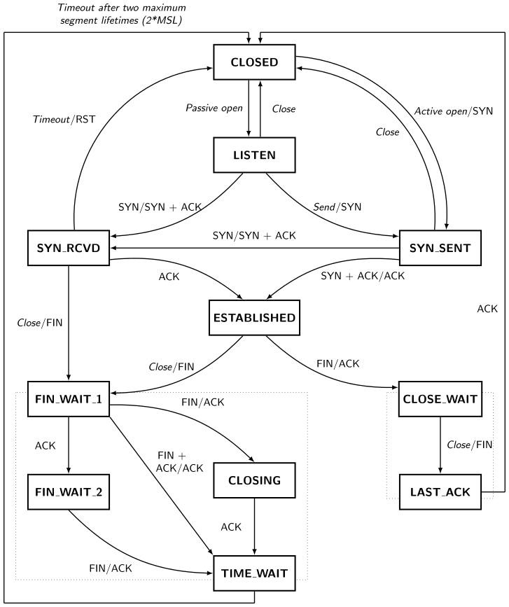

# 译：处理繁忙 Linux 服务器的 TCP TIME-WAIT

这篇文章是我在处理一个困扰我们很久的故障时通过 Google “偶然”找到的，而它真的把问题解决了。

## 前情提要

说“偶然”是因为我一开始搜索时用的关键字 `tcp_tw_reuse` 并不能解决问题，只是恰好它和这篇文章有关联。

前面提到的故障是指：**使用浏览器访问我们的某个 Web 平台时，会小概率出现浏览器一直转的情况，在等待数十秒之后才能正常加载页面。**

这个故障从有人向我提出到被解决，历时应该超过一年，因为它：

- 出现频率较低；
- 没有规律，无法稳定复现；
- 不属于致命性故障，加上人力有限，只能采取长期追踪逐步缩小排查范围的策略。

由于它出现频率实在是太低，当别人遇到再向我反馈时，往往已经错失了 debug 窗口。于是，我把别人反馈的信息与自己遇到此故障时所作的观察都记录在项目的 Redmind 里，得到以下一些初步结论：

1. 故障出现时，其他设备访问此 Web 平台是正常的；
2. 故障出现时，浏览器所在设备 `ping` 此 Web 平台是正常的（网络层应该没问题）；
3. 故障出现时，浏览器所在设备使用 `nc` 探测此 Web 平台所在 Linux 服务器的任意有监听开放端口都出现和浏览器类似的故障（传输层出现问题）；

从 `2.` 和 `3.` 可以推测，问题大概率在于传输层。HTTP 协议基于 TCP，很可能就是 TCP 连接建立过程出现意外。那么，如果是 UDP 协议会有问题吗？

```sh
$ nc -uv IP.IP.IP.IP 6666
Connection to IP.IP.IP.IP port 6666 [udp/*] succeeded!
```

`nc` 命令的 UDP 和 TCP 模式有个重要区别：不管 `nc` 什么端口，UDP 模式的结果总会是 `succeeded!`。但是，如果在服务器端使用 `nc` 以 UDP 模式监听端口（防火墙开放的端口），当它收到 UDP 包时会打印出 `XXXX` 字符，并且可以传送消息，据此可以判断服务器到底有没有接收到 UDP 包。

于是，在某次故障复现时，我以最快速度做了如下操作，结果是故障出现时，UDP 包可以正常接收到：

```sh
# 1. server side
$ sudo nc -luk 0.0.0.0 6666

# 2. client side
$ nc -uv IP.IP.IP.IP 6666
Connection to IP.IP.IP.IP port 6666 [udp/ssh] succeeded!

# 3. server side: output
XXXX

# 4. client side: type & send 'hello'
Connection to IP.IP.IP.IP port 6666 [udp/ssh] succeeded!
hello

# 5. server side: output
XXXXhello
```

在总结出上面这些现象后，我找了阿里云售后工程师咨询（阿里云的售后还是很专业的）。对面询问我是否修改过服务器的 `net.ipv4.tcp_tw_reuse` 参数。我表示没有，同时也不知道这个参数的作用是什么。因此搜索了一番而找到上文提到的这篇文章，并且根据文章可以判断出问题在于启用了另外一个 ipv4 内核参数：`net.ipv4.tcp_tw_recycle`。

### 修改内核参数

`net.ipv4.tcp_tw_recycle` 这个内核参数是哪位同事启用的应该已经不可考，不过我猜他大概是为了优化 TCP 连接数而做的修改。

好消息是这个内核参数可以在 Linux 运行时修改而不必重启，[sysctl(8)](https://man7.org/linux/man-pages/man8/sysctl.8.html) 命令就是专门用来做这件事的：

```sh
sudo vim /etc/sysctl.conf

# 在 /etc/sysctl.conf 中增加如下配置，并保存退出
net.ipv4.tcp_tw_recycle = 0

# reload /etc/sysctl.conf
sudo sysctl -p
```

在更新之后，此故障再也没有出现过。

### 相关资料

这个过程中还查阅了其他资料：

- [What are the ramifications of setting tcp_tw_recycle/reuse to 1?](https://serverfault.com/questions/342741/what-are-the-ramifications-of-setting-tcp-tw-recycle-reuse-to-1). *serverfault.com*.
- [Dropping of connections with tcp_tw_recycle](https://stackoverflow.com/questions/8893888/dropping-of-connections-with-tcp-tw-recycle). *stackoverflow.com*.
- [Linux Advanced Routing & Traffic Control HOWTO - Chapter 13. Kernel network parameters - 13.2.1. Generic ipv4](https://tldp.org/HOWTO/Adv-Routing-HOWTO/lartc.kernel.obscure.html#AEN1252). *tldp.org*.

## 译文

::: info 关于原文

为了让自己尽可能理解原文（毕竟是改生产环境的内核网络参数），我决定将它翻译成中文。

- 原文：[Coping with the TCP TIME-WAIT state on busy Linux servers](https://vincent.bernat.ch/en/blog/2014-tcp-time-wait-state-linux)
- 作者：[Vincent Bernat](https://github.com/vincentbernat)
- 日期：2014.02.24
- 许可：根据作者网站的 [Licenses](https://vincent.bernat.ch/en/licenses) 信息，原文采用的许可证为 [CC BY-SA 4.0](https://creativecommons.org/licenses/by-sa/4.0/)。

本译文沿用 [CC BY-SA 4.0](https://creativecommons.org/licenses/by-sa/4.0/)。

:::

::: warning 📌 简述

不要启用 `net.ipv4.tcp_tw_recycle`——从 Linux 4.12 开始这个参数就不存在了。大多数时候，`TIME-WAIT` 状态的 socket 是无害的。否则，请查看推荐解决方案的[总结](#总结)。

Linux 内核文档对于理解 `net.ipv4.tcp_tw_recycle` 和 `net.ipv4.tcp_tw_reuse` 有何作用的帮助不大。由于缺乏文档，许多调优指南建议将这两个参数都设置为 1，以减少 `TIME-WAIT` 状态的 socket 数量。然而，正如 [tcp(7)](https://manpages.debian.org/buster/manpages/tcp.7.en.html) 手册所述，`net.ipv4.tcp_tw_recycle` 选项对于面向公众的服务器来说是相当有问题的，因为它无法处理这样的多个连接：来自同一个 NAT 设备背后的两台不同计算机。这是一个很难检测出来并且可能会随时坑你的问题：

> Enable fast recycling of TIME-WAIT sockets. Enabling this option is not recommended since this causes problems when working with NAT (Network Address Translation).
>
> 启用 `TIME-WAIT` socket 的快速回收。不建议启用此选项，因为在使用 NAT（网络地址转换）时它会导致一些问题。

:::

下文将会更详细地解释如何正确处理 `TIME-WAIT` 状态。另外，本文讲述的是 Linux 的 TCP 协议栈。这与 *Netfilter* 连接追踪完全无关，它可以通过其他方式进行调整。[^netfilter]

[^netfilter]: 值得注意的是，调整 `net.netfilter.nf_conntrack_tcp_timeout_time_wait` 不会改变 TCP 协议栈处理 `TIME-WAIT` 状态的方式。

## 关于 `TIME-WAIT` 状态

让我们先回顾一下什么是 `TIME-WAIT` 状态，参见下面的 TCP 状态图：[^tcp_diagram]

{.transparent-img}

[^tcp_diagram]: 该图的许可证为 [LaTeX Project Public License 1.3](https://www.latex-project.org/lppl.txt)。原始文件可在此[页面](http://www.texample.net/tikz/examples/tcp-state-machine/)上找到。

只有***先关闭连接的一端***才会进入 `TIME-WAIT` 状态。另一端则会遵循使它快速结束连接的路径。

你可以使用 `ss -tan` 查看当前的连接状态：

```sh
$ ss -tan | head -5
LISTEN     0  511             *:80              *:*
SYN-RECV   0  0     192.0.2.145:80    203.0.113.5:35449
SYN-RECV   0  0     192.0.2.145:80   203.0.113.27:53599
ESTAB      0  0     192.0.2.145:80   203.0.113.27:33605
TIME-WAIT  0  0     192.0.2.145:80   203.0.113.47:50685
```

### 用途

`TIME-WAIT` 状态有两个用途：

[^no_timewait]: [RFC1337](https://www.rfc-editor.org/rfc/rfc1337) 中提出的第一个解决方法是忽略 `TIME-WAIT` 状态下的 *RST* 包 (RST segments)。这个行为由 `net.ipv4.rfc1337` 控制，Linux 默认不启用该功能，因为它不是解决 RFC 中所述问题的完整方案。

- 最为人所知的用途是***防止前一个连接延迟的包 (segments)*** 被后续依赖于相同四元组（源地址、源端口、目标地址、目标端口）的连接所接收。序列号 (sequence number) 也需要在一定范围内才能被接收。这稍微缓解了问题，但并不能完全解决，特别是在具有大接收窗口的高速连接上。[RFC1337](https://www.rfc-editor.org/rfc/rfc1337) 详细解释了 `TIME-WAIT` 状态时长不足时会发生什么。[^no_timewait] 例如，不缩短 `TIME-WAIT` 状态可以避免如下情况：

{.transparent-img}

[^last_ack]: 当一个连接处于 `LAST-ACK` 状态时，它会重新传输最后一个 *FIN* 包直到收到期望的 *ACK* 包。因此，它不太可能长时间处于这种状态。

- 另一个用途是***确保远程端已关闭连接***。假如最后一个 *ACK​​* 包丢失了，远程端将停留在 `LAST-ACK` 状态。[^last_ack] 如果没有 `TIME-WAIT` 状态，当远程端仍然认为先前的连接有效时，一个连接可能会被重新打开。当它收到一个 *SYN* 包（并且序列号匹配），它将回复一个 *RST* 包，因为此时收到一个 *SYN* 包不符合预期。此时，新的连接将因错误而被终止：

{.transparent-img}

[RFC 793](https://www.rfc-editor.org/rfc/rfc793) 要求 `TIME-WAIT` 状态的持续时间是 MSL (Maximum Segment Lifetime) 的两倍。在 Linux 上，这个持续时间是***不可***调节的，它在 `include/net/tcp.h` 中被定义为一分钟：

```c
#define TCP_TIMEWAIT_LEN (60*HZ) /* how long to wait to destroy TIME-WAIT
                                  * state, about 60 seconds     */
```

有人曾[提出将其转变为一个可调节的值](https://web.archive.org/web/20141227212940/http://comments.gmane.org/gmane.linux.network/244411)，但基于 `TIME-WAIT` 状态的好处，这一提议被否决了。

## 存在哪些问题

接下来我们看一下在处理大量连接的服务器上，为什么这个状态会是个麻烦。有三个方面：

- 连接表中使用的“插槽” (slot) 会阻止相同四元祖的***新连接***；
- 内核中 socket 结构体占用的***内存***；
- 额外的 ***CPU 开销***。

`ss -tan state time-wait | wc -l` 的结果本身并不能说明问题！

### 连接表槽 (Connection table slot)

`TIME-WAIT` 状态的连接在连接表中会被保留一分钟。这意味着另一个具有相同*四元组*（源地址、源端口、目标地址、目标端口）的连接不能存在。

对于一个 Web 服务器来说，目标地址和目标端口通常是固定的。如果你的 Web 服务器位于一个 L7 负载均衡器后面，那么源地址也是固定的。在 Linux 上，默认情况下客户端的端口分配范围大约有 30,000 个（可以通过 `net.ipv4.ip_local_port_range` 调整）。这意味着 Web 服务器和负载均衡器之间的连接每分钟只能建立大约 30,000 个，即***每秒约 500 个连接***。

如果 `TIME-WAIT` 是位于客户端，这种本地端口不够用的情况很容易检测到。因为应用程序调用 `connect()` 时会返回 `EADDRNOTAVAIL` 错误，此时它会把相关的错误信息记录下来。在服务器端情况要复杂一些，因为服务端没有这种（主动调用接口而产生的）错误日志和统计信息可依赖。如果怀疑服务端遇到了此问题，可以尝试利用一些确定的信息来列出已使用的四元组数量：

```sh
$ ss -tan 'sport = :80' | awk '{print $(NF)" "$(NF-1)}' | \
>     sed 's/:[^ ]*//g' | sort | uniq -c
    696 10.24.2.30 10.33.1.64
   1881 10.24.2.30 10.33.1.65
   5314 10.24.2.30 10.33.1.66
   5293 10.24.2.30 10.33.1.67
   3387 10.24.2.30 10.33.1.68
   2663 10.24.2.30 10.33.1.69
   1129 10.24.2.30 10.33.1.70
  10536 10.24.2.30 10.33.1.73
```

[^more_quad]: 在客户端，较老版本的内核还必须为每个主动发出的连接找到一个***可用本地元组 (free local tuple)***（源地址和源端口）。增加服务器端口或 IP 数量在这种情况下无济于事。Linux 3.2 已经版本足够新，可以为不同的目标连接共享相同的本地元组。感谢 Willy Tarreau 在这个问题上的[见解](http://marc.info/?l=haproxy&m=139315382127339&w=2)。

解决方案是***允许更多的四元组***。[^more_quad] 有几种方法可实现（按设置难度排序）：

[^balancer_ips]: 为了避免 `EADDRINUSE` 错误，负载均衡器在调用 [`bind()` 与 `connect()`](https://idea.popcount.org/2014-04-03-bind-before-connect/) 之前需要使用 `SO_REUSEADDR` 选项。
[^web_ips]: 这个最后的解决方案可能看起来有点愚蠢，因为你可以直接使用更多的端口，但有些服务器无法以这种方式进行配置。倒数第二个解决方案设置起来可能也会相当麻烦，这取决于具体的负载均衡软件，但它使用的 IP 较少。

- 通过 `net.ipv4.ip_local_port_range` 设置更大范围来使用***更多的客户端端口***；
- 通过让 Web 服务器监听额外的端口（81、82、83……）来使用***更多的服务器端口***；
- 通过给负载均衡器配置额外的 IP，并以轮询方式使用它们来使用***更多的客户端 IP***；[^balancer_ips]
- 通过给 Web 服务器配置额外的 IP 来使用***更多的服务器 IP***。[^web_ips]

最后的解决方案是调整 `net.ipv4.tcp_tw_reuse` 和 `net.ipv4.tcp_tw_recycle`。但是先别这样做，稍后会详细介绍这两个配置。

### 内存 (Memory)

服务器有众多连接需要处理，每一个 socket 维持开放多一分钟都会消耗服务器的内存。例如，如果想要每秒处理大约 10,000 个新连接，则相应会有大约 600,000 个处于 `TIME-WAIT` 状态的 socket。这意味着多少内存呢？其实并不多！

首先从应用程序的角度来看，`TIME-WAIT` 状态的 socket 不会占用任何内存：对应用程序来说它们已经关闭了。在内核中，`TIME-WAIT` socket 存在于三个结构体中（有三种不同用途）：

1. 一个***连接的哈希表 (hash table of connections)***，名为 "TCP established hash table"（尽管其中包含其他状态的连接），用于定位现有的连接，比如在接收新的包时。

    该哈希表的每个桶 (bucket) 都包含处于 `TIME-WAIT` 状态的连接列表和常规活跃连接列表。哈希表的大小取决于系统内存，它在启动时会被打印出来：

    ```sh
    $ dmesg | grep "TCP established hash table"
    [    0.169348] TCP established hash table entries: 65536 (order: 8, 1048576 bytes)
    ```

    通过调整 `thash_entries` 内核参数可以覆盖默认的哈希表条目数 (hash table entries)。

    [^struct_tw]: 自 Linux 2.6.14 起，`TIME-WAIT` 状态的 socket 使用了专用的内存结构体。[`struct sock_common` 结构体](https://elixir.bootlin.com/linux/v3.12/source/include/net/sock.h#L157)有点冗长，此处就不赘述了。

    在 `TIME-WAIT` 状态的连接列表中，每个元素都是一个 `struct tcp_timewait_sock` 结构体，而其他状态的连接类型是 `struct tcp_sock`：[^struct_tw]

    ```c
    struct tcp_timewait_sock {
        struct inet_timewait_sock tw_sk;
        u32    tw_rcv_nxt;
        u32    tw_snd_nxt;
        u32    tw_rcv_wnd;
        u32    tw_ts_offset;
        u32    tw_ts_recent;
        long   tw_ts_recent_stamp;
    };

    struct inet_timewait_sock {
        struct sock_common  __tw_common;

        int                     tw_timeout;
        volatile unsigned char  tw_substate;
        unsigned char           tw_rcv_wscale;
        __be16 tw_sport;
        unsigned int tw_ipv6only     : 1,
                     tw_transparent  : 1,
                     tw_pad          : 6,
                     tw_tos          : 8,
                     tw_ipv6_offset  : 16;
        unsigned long            tw_ttd;
        struct inet_bind_bucket *tw_tb;
        struct hlist_node        tw_death_node;
    };
    ```

2. 一***系列的连接列表***，被称为 "death row"（死囚区），用于使 `TIME-WAIT` 状态的连接过期。它们按照到期前剩余的时间进行排序。

    [^death_row]: 自 [Linux 4.1](https://git.kernel.org/pub/scm/linux/kernel/git/torvalds/linux.git/commit/?id=789f558cfb3680aeb52de137418637f6b04b7d22) 版本起，追踪 `TIME-WAIT` socket 的方式已经被修改以提高性能和并行度。"death row" 如今只是一个哈希表。

    它使用与连接哈希表条目相同的内存大小。它是 `struct inet_timewait_sock` 结构体中的`struct hlist_node tw_death_node` 成员。[^death_row]

3. 一个***绑定端口的哈希表***，用于保存本地绑定的端口和相关参数，以确定是否可以安全监听给定的端口，或在动态绑定的情况下找到一个空闲端口。这个哈希表的大小与连接哈希表大小相同：

    ```sh
    $ dmesg | grep "TCP bind hash table"
    [    0.169962] TCP bind hash table entries: 65536 (order: 8, 1048576 bytes)
    ```

    这个表的每个元素都是一个 `struct inet_bind_socket` 结构体。对于每个本地绑定的端口都有一个对应的元素。一个连接到 Web 服务器的 `TIME-WAIT` 连接会绑定到服务器本地的 80 端口，并与其同级的其他 `TIME-WAIT` 连接共享同一个条目。另一方面，与远程服务相连的连接会随机绑定到本地某个端口，并且不与其他连接共享同一个条目。

    我们只关心 `struct tcp_timewait_sock` 和 `struct inet_bind_socket` 所占用的空间。处于 `TIME-WAIT` 状态的每个连接（入站或出站），都有一个 `struct tcp_timewait_sock` 结构体。对于每个出站连接，都有一个专用的 `struct inet_bind_socket` 结构体，入站连接则没有。

    一个 `struct tcp_timewait_sock` 结构体是 168 字节，一个 `struct inet_bind_socket` 结构体是 48 字节。

    ```sh
    $ sudo apt-get install linux-image-$(uname -r)-dbg
    […]
    $ gdb /usr/lib/debug/boot/vmlinux-$(uname -r)
    (gdb) print sizeof(struct tcp_timewait_sock)
    $1 = 168
    (gdb) print sizeof(struct tcp_sock)
    $2 = 1776
    (gdb) print sizeof(struct inet_bind_bucket)
    $3 = 48
    ```

    如果有大约 40,000 个处于 `TIME-WAIT` 状态的入站连接，那么它们应该占用不到 10 MiB 内存。如果有大约 40,000 个处于 `TIME-WAIT` 状态的出站连接，则需要额外考虑 2.5 MiB 内存。可以通过查看 `slabtop` 的输出来验证这一点。以下结果取自一个服务器，它大约有 50,000 个 `TIME-WAIT` 状态的连接，其中有 45,000 个是出站连接：

    ```sh
    $ sudo slabtop -o | grep -E '(^  OBJS|tw_sock_TCP|tcp_bind_bucket)'
     OBJS ACTIVE  USE OBJ SIZE  SLABS OBJ/SLAB CACHE SIZE NAME
    50955  49725  97%    0.25K   3397       15     13588K tw_sock_TCP
    44840  36556  81%    0.06K    760       59      3040K tcp_bind_bucket
    ```

    结论不变：`TIME-WAIT` 连接使用的内存***真的非常少***。如果一个服务器每秒需要处理数千个新连接，你确实需要更多的内存才能高效地向客户端推送数据。而 `TIME-WAIT` 连接的开销可以忽略不计。

### CPU

在 CPU 方面，查找空闲的本地端口可能会不小的开销。这项工作由 [`inet_csk_get_port()` 函数](https://elixir.bootlin.com/linux/v3.12/source/net/ipv4/inet_connection_sock.c#L104)完成，它会使用锁，并遍历本地端口，直到找到一个空闲端口。当有大量处于 `TIME-WAIT` 状态的出站连接（例如到 *Memcached* 服务器的临时连接）时，对应的哈希表中也会有大量条目，不过这通常不会成为问题：这些连接通常共享相同的 profile（注：应该是指相同的目标地址和目标端口），上述函数会按顺序遍历它们并很快找到一个空闲端口（注：应该与 `inet_csk_get_port()` 函数的具体实现有关）。

## 其他解决方案

如果在阅读了前面的部分后，你还是认为那些 `TIME-WAIT` 连接存在问题，这里有三个额外的解决方案可以减少它们：

- 禁用 socket 延迟关闭 (disable socket lingering)；
- 调整 `net.ipv4.tcp_tw_reuse` 参数；
- 调整 `net.ipv4.tcp_tw_recycle` 参数。

### Socket 延迟关闭 (Socket lingering)

当应用程序调用 `close()` 函数时，内核缓冲区中剩余的任何数据都会在被内核发送出去，socket 最终会转为 `TIME-WAIT` 状态。如此一来，应用程序可以立即继续工作，并假设所有数据最终都会被安全地传送。

然而，应用程序可以选择禁用这种行为，即 *socket 延迟关闭 (socket lingering)*。有两种方式：

1. 在第一种方式中，***任何剩余的数据将被丢弃***，并且不是使用正常的四次挥手来关闭连接，而是使用一个 *RST* 包（因此，对方将检测到错误）来关闭连接并立即销毁。在这种情况下，不存在 `TIME-WAIT` 状态。
2. 在第二种方式中，如果 socket 发送缓冲区中还有数据，那么当应用程序调用 `close()` 函数时，进程将会休眠，直到所有数据被发送并被对等方确认，或者直到配置的延迟计时器到期。通过将 socket 设置为非阻塞，可以使进程不休眠。在这种情况下，同样的过程将在后台进行。它允许剩余的数据在配置的超时时间内被发送出去，但如果数据成功发送，将执行正常的关闭程序，并进入 `TIME-WAIT` 状态。而在前一种方式中，是以 *RST* 方式关闭连接，并丢弃剩余的数据。

在这两种情况下，***禁用 socket 延迟关闭并不是一种适用于所有情况的解决方案***。在从上层协议角度来看安全的情况下，它可能会被一些应用程序（如 [HAProxy](https://www.haproxy.org/) 或 [Nginx](https://nginx.org/)）使用。而无条件地禁用它并不是合理的做法。

### `net.ipv4.tcp_tw_reuse`

`TIME-WAIT` 状态可以防止延迟的报文被无关的连接所接收。然而在某些情况下，可以假设新连接的报文不会与旧连接的报文混淆。

[RFC1323](https://www.rfc-editor.org/rfc/rfc1323) 提出了一组 TCP 扩展，以改善在高带宽路径上的性能。其中一项是定义了一个新的 TCP 选项，它包含两个四字节的***时间戳字段***。第一个字段是发送该选项的 TCP 的时间戳时钟的当前值，而第二个字段是从远程主机接收到的最新时间戳。

通过启用 `net.ipv4.tcp_tw_reuse` 参数，Linux 会在新的***出站连接***的时间戳严格大于前一连接记录的最新时间戳时，重用处于 `TIME-WAIT` 状态的现有连接：这意味着在 `TIME-WAIT` 状态的出站连接只需等待一秒后就可以被重用。

这样做如何保证安全？`TIME-WAIT` 状态的首要目的是避免重复的报文被不相关的连接接收。由于使用了时间戳，此类重复的报文将带有过时的时间戳，因此会被丢弃。

第二个目的是确保远端不会因为丢失最后一个 *ACK* 包而处于 `LAST-ACK` 状态。远端将重传 *FIN* 报文，直到

1. 等待超时，并中断连接；
2. 或者收到等待中的 *ACK*，并中断连接；
3. 或者收到 *RST*，并中断连接。

如果 *FIN* 包被按时接收到，本地端此时 socket 仍处于 `TIME-WAIT` 状态，并将发送预期的 *ACK* 包。

一旦新连接取代了某个 `TIME-WAIT` 连接，新连接的 *SYN* 包就会被忽略（归功于时间戳），并且不会有 *RST* 应答，而只会收到 *FIN* 包的重传。远程端收到 *FIN* 包后将以 *RST* 作为回应（因为本地连接处于 `SYN-SENT` 状态），这样就可以跳出 `LAST-ACK` 状态。由于没有应答，最初的 *SYN* 包将会被重新发送（一秒钟后），在这之后连接就可以建立起来，除了稍有延迟外并不会出现显式的错误：

{.transparent-img}

值得注意的是，当连接被重复使用时，*TWRecycled* 计数器会增加（尽管名称似乎对不上）。

### `net.ipv4.tcp_tw_recycle`

[^tw_recycle]: 当服务器首先关闭连接时，它会进入 `TIME-WAIT` 状态，而客户端将认为相应的四元组变成可用状态，因此将其重新用于新的连接。

这个机制也依赖于前文提到的时间戳选项，但***同时影响入站和出站连接***。当服务器通常会先关闭连接时，这个机制会非常方便。[^tw_recycle]

此时 `TIME-WAIT` 状态会被设置更早的过期时间：它将在重传超时 *(RTO, Retransmission Timeout)* 间隔（根据 RTT (Round-Trip Time) 及其方差计算得出）之后被移除。可以使用 `ss` 命令观察当前连接使用的值：

```sh
$ ss --info  sport = :2112 dport = :4057
State      Recv-Q Send-Q    Local Address:Port        Peer Address:Port
ESTAB      0      1831936   10.47.0.113:2112          10.65.1.42:4057
         cubic wscale:7,7 rto:564 rtt:352.5/4 ato:40 cwnd:386 ssthresh:200 send 4.5Mbps rcv_space:5792
```

为了保持 `TIME-WAIT` 状态所提供的保证，同时减小过期计时器的值，当一个连接进入 `TIME-WAIT` 状态时，最新的时间戳会被记录在一个专用结构体中，该结构体包含此前目标地址的各种参数。然后，除非 `TIME-WAIT` 状态已过期，如果来自远程主机的报文不严格大于最新记录的时间戳， Linux 就会丢弃这些报文：

```c
if (tmp_opt.saw_tstamp &&
    tcp_death_row.sysctl_tw_recycle &&
    (dst = inet_csk_route_req(sk, &fl4, req, want_cookie)) != NULL &&
    fl4.daddr == saddr &&
    (peer = rt_get_peer((struct rtable *)dst, fl4.daddr)) != NULL) {
        inet_peer_refcheck(peer);
        if ((u32)get_seconds() - peer->tcp_ts_stamp < TCP_PAWS_MSL &&
            (s32)(peer->tcp_ts - req->ts_recent) > TCP_PAWS_WINDOW) {
                NET_INC_STATS_BH(sock_net(sk), LINUX_MIB_PAWSPASSIVEREJECTED);
                goto drop_and_release;
        }
}
```

当远程主机是 ***NAT 设备***时，这个时间戳条件就会禁止 NAT 设备后面的某一台主机之外的所有其他主机在一分钟内进行连接，因为它们不共享相同的时间戳时钟。如果拿不准，最好禁用此选项，因为它会导致***难以检测***和***难以诊断***的问题。

> 注：这里的解释不是很清楚，补充 `兔子先生` 一篇相关博文的链接：[好朋友 TIME_WAIT](https://liupzmin.com/2020/02/26/network/tcp-time-wait/)

📌 *更新 (2017-09)*

从 Linux 4.10 (commit [95a22caee396](https://git.kernel.org/pub/scm/linux/kernel/git/torvalds/linux.git/commit/?id=95a22caee396cef0bb2ca8fafdd82966a49367bb)) 开始，Linux 会为每个连接随机化时间戳偏移量，使得这个选项完全失效（无论有没有 NAT）。在 Linux 4.12 中它已经被完全[删除](https://git.kernel.org/pub/scm/linux/kernel/git/torvalds/linux.git/commit/?id=4396e46187ca5070219b81773c4e65088dac50cc)。

`LAST-ACK` 状态的处理方式则与 `net.ipv4.tcp_tw_reuse` 相同.

## 总结

通用解决方案是通过使用更多服务器端口等来***增加可能的四元祖数量***。这可以使允许的 `TIME-WAIT` 连接不被用尽。

在***服务器端***，千万不要启用 `net.ipv4.tcp_tw_recycle`，因为它会产生副作用。启用 `net.ipv4.tcp_tw_reuse` 对优化入站连接无效。

在***客户端***，启用 `net.ipv4.tcp_tw_reuse` 是另一种基本安全的解决方案。在启用 `net.ipv4.tcp_tw_reuse` 的基础上，启用 `net.ipv4.tcp_tw_recycle` 基本上没有什么用处。

此外，在设计协议时，***不要让客户端先关闭***。客户端不必处理 `TIME-WAIT` 状态，将责任推给更适合处理此问题的服务器。

最后引用 [W. Richard Stevens](http://www.kohala.com/start/) 在[《Unix 网络编程》](https://www.amazon.com/Unix-Network-Programming-Volume-Networking/dp/0131411551)中的一段话：

> *`TIME_WAIT` 状态是我们的朋友，它可以帮助我们（即是，使旧的重复报文在网络中过期）。与其试图避免该状态，不如真正地理解它。*
